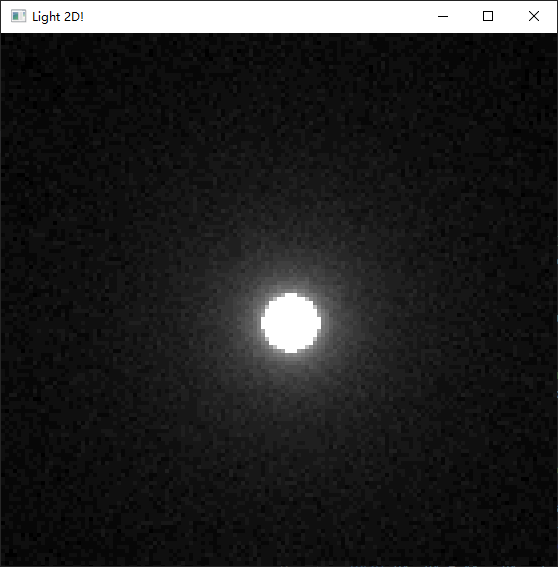
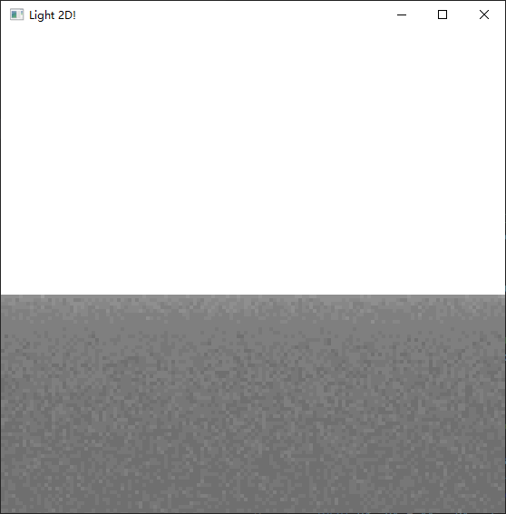
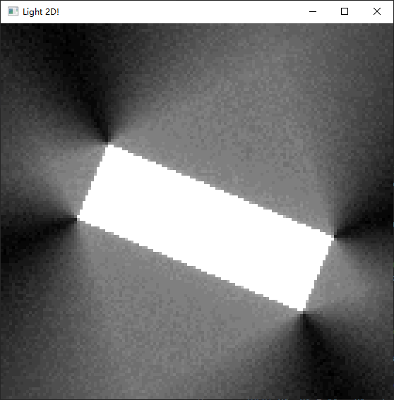
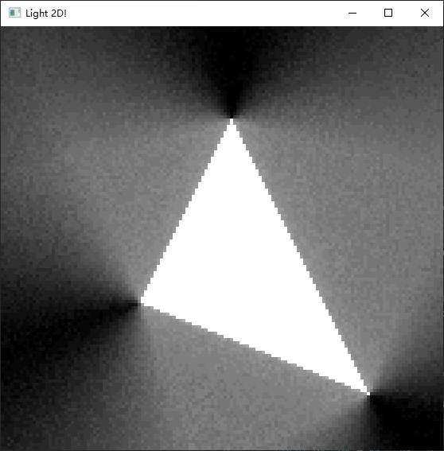
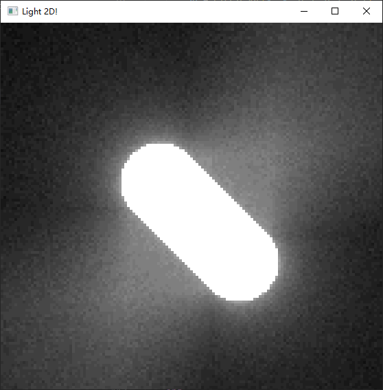

lua-fenster-playground

play with key '1/2/3'

- https://github.com/jonasgeiler/lua-fenster
- https://github.com/jonasgeiler/lua-fenster/discussions/21

## windows

```
.\luajit.exe .\01heart.lua
```

## macOS

```shell
./luajit 01heart.lua
./luajit 02light.lua
```


## Light 2D






## Thanks

- https://github.com/jonasgeiler/lua-fenster
- http://miloyip.com/graphics/
- https://github.com/miloyip/light2d

