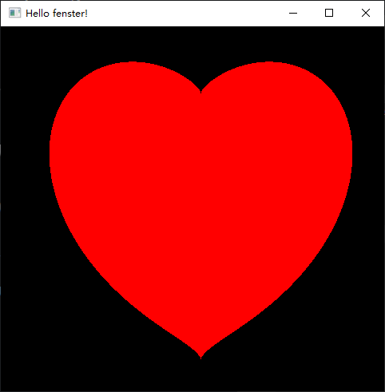
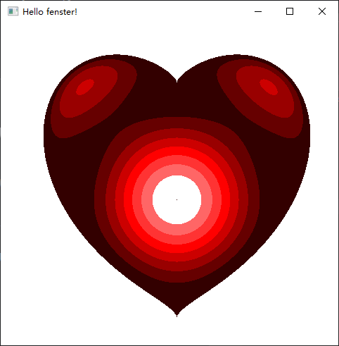
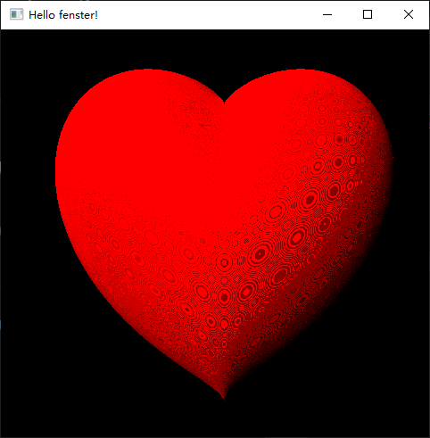
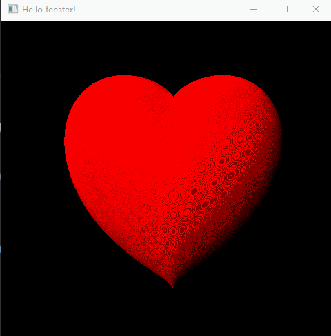

lua-fenster-playground

play with key '1/2/3'

- https://github.com/jonasgeiler/lua-fenster
- https://github.com/jonasgeiler/lua-fenster/discussions/21

## windows

```
.\luajit.exe .\01heart.lua
```





